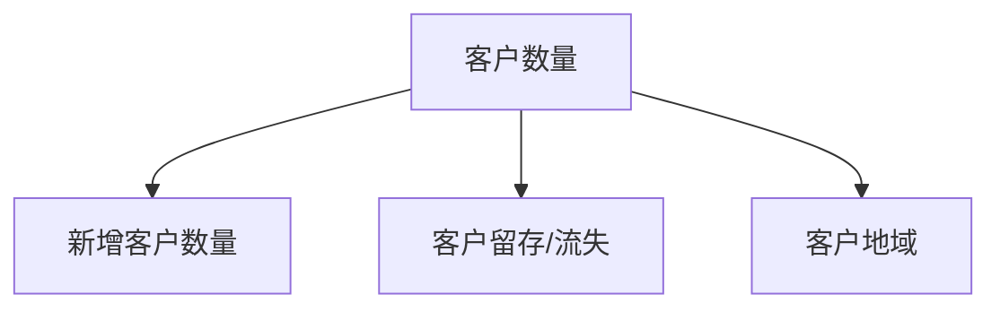
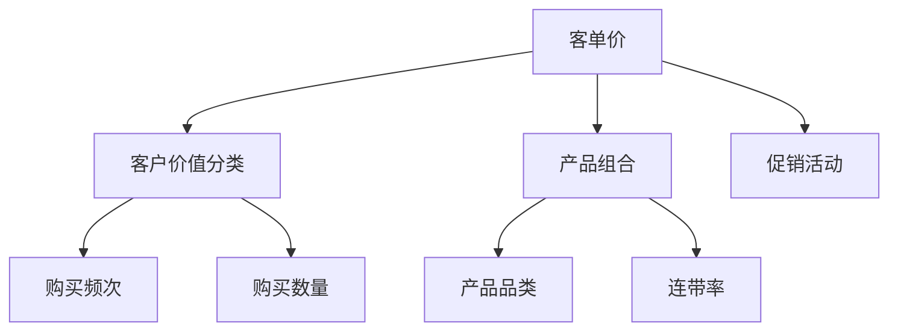

+++

title = 'ToB 分析思路整理'
description = "塞sssss缝赛"
date = 2024-06-19T15:59:37+08:00

+++

# ToB 分析思路整理

## 宏观分析

根据对数据的客户和物料维度分析，发现**销售**和**客户数量**正相关，和**物料**没有必然联系。  对销售直接相关的客户指标进行梳理：

* 客户数量
* 客单价
* 客户购买频率

对以上指标进行历史数据分析找出关键性正向指标

## 指标分解

通过对上面指标的历史对比分析，金额和客单价还有客户数量有相似趋势，所以得出一下公式：
$$
销售=客户数量 \times 客单价
$$
通过业务进一步分解这个公式

* 新增客户：1.新客户贡献和增长情况 2.新客户的流转情况
* 客户留存/流失：1.客户留存/流失率 2.客户满意度调查是内部原因还是环境原因
* 客户地域：1.不同地域的客户新客户和重要客户的数量和留存情况 2.散户和大客户各年趋势

* 客户价值：1.购买频次的变化  2.数量  买的越多单价越高
* 产品组合：1.产品品类分析了解售卖产品的结构和策略变化情况   2.连带率 查看连带提货的组合商品，从趋势图可以看出23年单量变少但是金额下滑不明显，是否是组合变多？
* 促销活动：促销是一种商品和方案，合理的促销可以促进客单价的提升

